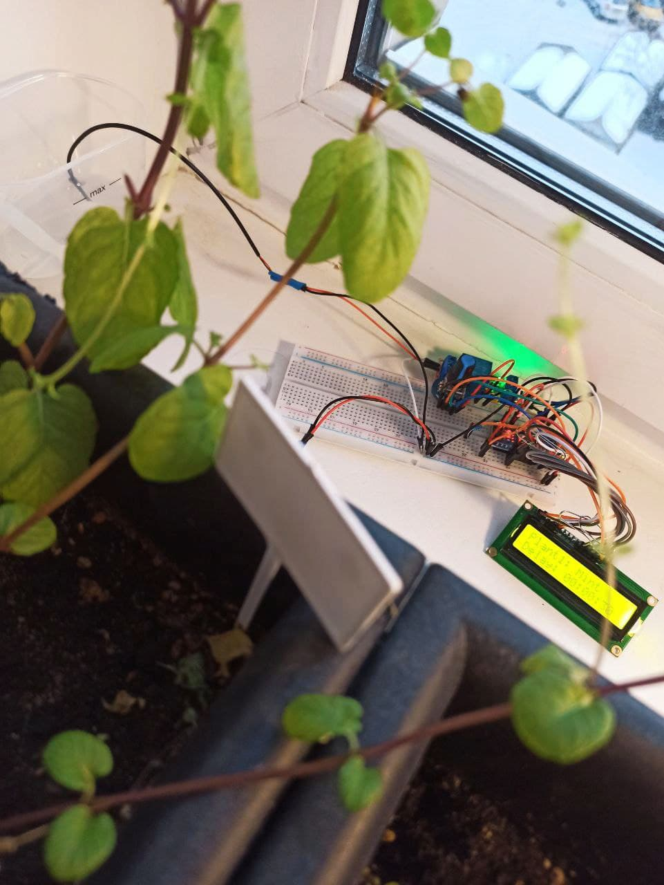

# Простая система автополива на микроконтроллере ATmega328P

## Описание
Данный проект представляет собой довольно простую систему автополива комнатных растений на основе микроконтроллера ATmega328P. Для настройки полива используется энкодер и дисплей. При прошивке можно добавить несколько растений, после чего, во время работы, настроить интервал между поливами и время самого полива в формате hh:mm:ss.

## Оборудование
* Микроконтроллер ATmega328P
* Символьный LCD дисплей 16x2
* Электромагнитное реле
* Энкодер (EC11)
* Помпа 5V
